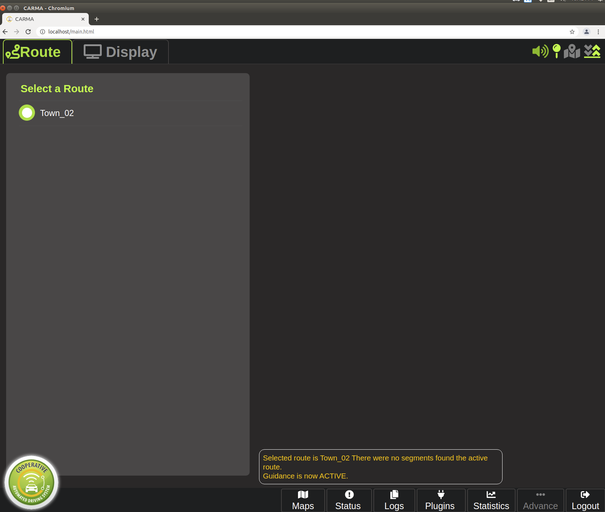

# CARMA-CARLA Integration Tool
This user guide provides step-by-step user instructions on how to build the CARMA-CARLA integration tool on Docker, setup configuration for both CARMA platform and CARMA-CARLA integration tool and run that with CARMA platform.

##  Requirement
-  Docker (19.03+)
-  [Nvidia Docker](https://github.com/NVIDIA/nvidia-docker)
-  [CARMA Platform](https://usdot-carma.atlassian.net/wiki/spaces/CRMPLT/pages/486178827/Development+Environment+Setup) (3.9.0)
-  [CARLA Simulation](https://carla-releases.s3.eu-west-3.amazonaws.com/Linux/CARLA_0.9.10.1.tar.gz) (0.9.10.1)

## Setup
### CARMA-CARLA Integration Docker Image
1. Clone the CARMA simulation repository:

```
git clone https://github.com/usdot-fhwa-stol/carma-carla-integration.git
```
Option 1. Build image from Dockerfile by using following command:

```sh
cd docker && ./build-image.sh
```

Option 2. Pull image from DockerHub by using following command:

```sh
docker pull usdotfhwastol/carma-carla-integration:carma-carla-[version]
```


### CARMA Platform config
The CARMA Config for the simulation currently cannot be pulled from docker hub. It requires local docker build for the image.

1. Clone the source code of CARMA config from github:
```sh
git clone https://github.com/usdot-fhwa-stol/carma-config.git
```
2. Switch branch.
```sh
git switch Update/carla_integration
```
3. Go to the directory /carla_integration under CARMA config and build the docker image. Remember the image name
```sh
cd carla_integration/ && ./build-image.sh
```
4. Setup CARMA config of the simulation
```sh
carma config set usdotfhwastol/carma-config:[tag]
```

## Run CARMA-CARLA integration tool with CARMA Platform

1. Run CARMA Platform with separated terminal
```
carma start all
```

2. Run CARLA server
```
./CarlaUE4.sh
```
3. Change the map to match with the CARMA Platform vector map (initial setting is Town02) by using the python script provided by CARLA in the path : **`CARLA_0.9.10/PythonAPI/util/config.py`**.
```
python config.py -m <map>
```

&emsp;4.1 Run the carma-carla docker container
  ```
  ./run.sh
  ```
&emsp;4.2 Setting the catkin source and Python path
  ```
  export PYTHONPATH=$PYTHONPATH:/home/PythonAPI/carla-0.9.10-py2.7-linux-x86_64.egg && source /home/carma_carla_ws/devel/setup.bash
  ```
&emsp;4.3 Launch the CARMA-CARLA integration tool
  ```
  roslaunch carma_carla_agent carma_carla_agent.launch town:='your_map_name' spawn_point:='spawn_point_info'
  ```

***Note: step 3 must be completed within 20 seconds after step 2 being completed***


5. Open CARMA-Web-UI to select route and plugins via Chromium Web Browser **`incognito window`** then click the circle button at the left bottom corner.



Afterward, the corresponding CARLA vehicle will start to receive control command from CARMA-Platform and start to following the selected route to move

## Usage instruction
The usage instruction includes what parameter could be parsed to CARMA-CARLA integration and the description of these parameters

### CARMA-CARLA Integration parameters
| Parameters| **Description**|*Default*|
| ------------------- | ------------------------------------------------------------ |----------|
|host|CARLA server IP address|127.0.0.1|
|port|CARLA server port number|2000|
|town|To specify which scenario for CARLA server to load. The scenario should be matched with executed CARMA Platform vector_map|Town02|
|spawn_point|To specify where to spawn CARLA vehicle|N/A|
|role_name|Assign the name of the CARLA vehicle. It currently only supports the name range from hero0 to hero9 and ego_vehicle|ego_vehicle|
|vehicle_model|To specify what vehicle model should be generated in CARLA server|vehicle.toyota.prius|
|vehicle_length|To specify the length of vehicle|5.00|
|vehicle_width|To specify the width of vehicle|3.00|
|vehicle_wheelbase|To specify the size of wheelbase for the vehicle|2.79|
|speed_Kp| Speed proportional value for the vehicle. The current default value was setup for Town02 with vehicle speed limit 20 MPH|0.05|
|speed_Ki| Speed integral value for the vehicle. The current default value was setup for Town02 with vehicle speed limit 20 MPH|0.018|
|speed_Kd| Speed derivative value for the vehicle. The current default value was setup for Town02 with vehicle speed limit 20 MPH|0.4|
|accel_Kp| Acceleration proportional value for the vehicle. The current default value was setup for Town02 with vehicle speed limit 20 MPH|0.053|
|accel_Ki| Acceleration integral value for the vehicle. The current default value was setup for Town02 with vehicle speed limit 20 MPH|0.0|
|accel_Kd| Acceleration derivative value for the vehicle. The current default value was setup for Town02 with vehicle speed limit 20 MPH|0.052|
|init_speed| To specify the initial vehicle speed |5|
|init_acceleration| To specify the initial vehicle acceleration |1|
|init_steering_angle| To specify the initial vehicle steering wheel angle, it range from 0.7(left) to -0.7(right)|0|
|init_jerk| To specify the initial vehicle jerk value|0|
